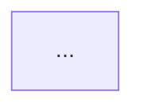

# vpcanvas - Premium Value Proposition Canvas Designer

> Systematically design value propositions that fit customer needs, map them end-to-end using structured Mermaid flows, style them to dark-blue/black aesthetics, and render them locally.

## Design Rules & Formatting

When a user requests a Value Proposition Canvas design, follow this structured process:

### 0. Core Idea Sync (Mandatory First Step)
Before mapping any canvas details, the agent **must** sync with the user on the core idea and definition of the service/product. Ask clarifying questions to establish:
* The precise target customer segment.
* The exact nature of the service/product (e.g., digital framework, data-driven system, operational process).
* The innovation context.
Do not proceed to step-by-step canvas mapping until the user has confirmed this core definition.

### 1. The Mapping Process
1. **Map Customer Profile (Right Side first):**
   * **CJ (Customer Jobs):** Functional, social, and emotional jobs (e.g., `CJ1`, `CJ2`).
   * **P (Customer Pains):** Frustrations, risks, and obstacles (e.g., `P1`, `P2`).
   * **G (Customer Gains):** Non-redundant outcomes, benefits, and delighters (e.g., `G1`, `G2`).
2. **Design Value Map (Left Side second):**
   * **PS (Products & Services / Features):** The core offerings (e.g., `PS1`, `PS2`).
   * **PR (Pain Relievers):** How the products alleviate specific pains (e.g., `PR1`, `PR2`).
   * **GC (Gain Creators):** How the products produce specific gains (e.g., `GC1`, `GC2`).

### 2. Non-Redundant Gains Rule
Ensure that Customer Gains are distinct, value-additive outcomes or delighters (e.g., scenario modeling, strategic stature, capability upskilling) that exceed basic expectations. They **must not** be simple opposites or mirror images of the defined Customer Pains (e.g., if a pain is "disconnected tools", the gain should **not** be "connected tools"; a true gain would be "what-if scenario modeling").

### 3. Strict End-to-End Mappings
All connections in the mapping diagram **must** start at a Feature and terminate at a Job, flowing explicitly through either a Pain Reliever/Pain path or a Gain Creator/Gain path.
* **Pain path:** `Feature (PS) --> Pain Reliever (PR) --> Pain (P) --> Customer Job (CJ)`
* **Gain path:** `Feature (PS) --> Gain Creator (GC) --> Gain (G) --> Customer Job (CJ)`
* **Shortcut Rule:** Do **not** connect Features directly to Customer Jobs.

---

## Mermaid Visual Style

Every generated Mermaid flowchart must use the following color palette and container styling:

### 1. Node Styling
All node types (`ps`, `pr`, `gc`, `cp`, `cg`, `cj`) must have a solid dark blue fill, black outline, and white text:
```mermaid
classDef ps fill:#1b365d,stroke:#000000,stroke-width:2px,color:#ffffff;
classDef pr fill:#1b365d,stroke:#000000,stroke-width:2px,color:#ffffff;
classDef gc fill:#1b365d,stroke:#000000,stroke-width:2px,color:#ffffff;

classDef cp fill:#1b365d,stroke:#000000,stroke-width:2px,color:#ffffff;
classDef cg fill:#1b365d,stroke:#000000,stroke-width:2px,color:#ffffff;
classDef cj fill:#1b365d,stroke:#000000,stroke-width:2px,color:#ffffff;
```

### 2. Container (Subgraph) Styling
All containers must have a transparent background (no fill) and solid black borders:
```mermaid
style ValueMap fill:none,stroke:#000000,stroke-width:2px;
style Features fill:none,stroke:#000000,stroke-width:1px;
style PainRelievers fill:none,stroke:#000000,stroke-width:1px;
style GainCreators fill:none,stroke:#000000,stroke-width:1px;

style CustomerProfile fill:none,stroke:#000000,stroke-width:2px;
style Pains fill:none,stroke:#000000,stroke-width:1px;
style Gains fill:none,stroke:#000000,stroke-width:1px;
style Jobs fill:none,stroke:#000000,stroke-width:1px;
```

---

## Automated Rendering to PNG

After creating or updating the `.md` canvas file in the workspace, run the bundled helper script to compile the Mermaid block to a PNG image:

### Execution Command:
```bash
python3 /home/lenovo/.gemini/antigravity/skills/vpcanvas/scripts/render_mermaid.py /path/to/value_proposition_canvas.md
```

### Embedding the Rendered Image:
Embed the generated image directly in the markdown file (just before the ` ```mermaid ` block) using its absolute path:
```markdown

```

---

## Example Template

```markdown
# Value Proposition Canvas: [Product Name]

Target Customer: **[Segment]**

---

## 1. CUSTOMER PROFILE
* Customer Jobs (CJ)
* Customer Pains (P)
* Customer Gains (G)

---

## 2. VALUE MAP
* Products & Services (PS)
* Pain Relievers (PR)
* Gain Creators (GC)

---

## 3. FIT & CONNECTION VISUALIZATION



