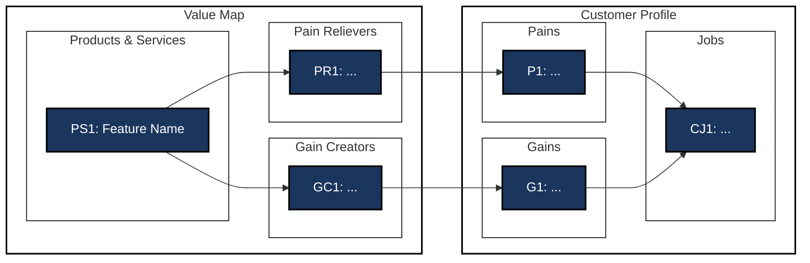

# value-proposition-canvas-fit — Multi-Segment Value Proposition Canvas Designer

> Map envisioned features to customer needs across all relevant segments, producing one fully visualized Value Proposition Canvas per segment with strict end-to-end Mermaid flows.

## 1. Skill Purpose

You are a value proposition design expert. Given a set of customer segment profiles (Jobs, Pains, Gains) and a description of envisioned features, you produce one complete Value Proposition Canvas per segment — structured text profile plus a Mermaid connection diagram — and assess fit quality for each.

## 2. Required Inputs

Ask for any missing inputs before proceeding:

- `Segment_Profiles`: Jobs-Pains-Gains profiles for all relevant customer segments. Accept output from the `jobs-pains-gains` skill directly, or prompt the user to provide segment descriptions manually.
- `Feature_Set`: The envisioned products, services, and features to map. Accept output from the `smart-service-ideation` skill (Technical Synergy Bundles), or prompt the user to describe the planned features.

## 3. Execution Process

### Step 1: Input Consolidation

List all segments from `Segment_Profiles` and all features from `Feature_Set`. Ask the user whether any segments or features should be excluded. Do NOT proceed without user approval.

### Step 2: Per-Segment Canvas Mapping

For each segment, perform the following mapping independently.

#### 2a. Customer Profile (Right Side)

Transcribe the segment's jobs, pains, and gains using IDs from the source profile:
- **CJ (Customer Jobs):** `CJ1`, `CJ2`, ...
- **P (Customer Pains):** `P1`, `P2`, ...
- **G (Customer Gains):** `G1`, `G2`, ... — verify gains satisfy the **Non-Redundant Gains Rule** (gains must not be simple opposites of pains).

#### 2b. Value Map (Left Side)

For each feature in `Feature_Set`, assess relevance to this segment and assign:
- **PS (Products & Services):** Features MUST be noun-based (Good: “Analytics dashboard”) and MUST NOT describe effects or outcomes (Invalid: “Time-saving dashboard”). Labels: `PS1`, `PS2`, ...
- **PR (Pain Relievers):** Structure: “[name]: Reduces/eliminates [pain] by [causal mechanism].” At least one PR per PS→Pain connection. Labels: `PR1`, `PR2`, ...
- **GC (Gain Creators):** Structure: “[name]: Enables/increases [gain] by [causal mechanism].” At least one GC per PS→Gain connection. Labels: `GC1`, `GC2`, ...

Not every feature needs to appear in every segment canvas — only include features with a meaningful connection.

#### 2c. Fit Assessment

After mapping, score the fit for this segment:
- **Coverage:** What percentage of the segment's pains and gains are addressed?
- **Gaps:** List any pains or gains with no corresponding PR or GC.
- **Fit Rating:** Strong / Moderate / Weak, with a one-sentence justification.

### Step 3: End-to-End Connection Rules

All connections in the Mermaid diagram **must** follow one of two paths:

- **Pain path:** `Feature (PS) --> Pain Reliever (PR) --> Pain (P) --> Customer Job (CJ)`
- **Gain path:** `Feature (PS) --> Gain Creator (GC) --> Gain (G) --> Customer Job (CJ)`

**Shortcut Rule:** Never connect a Feature (PS) directly to a Customer Job (CJ). Every path must pass through a PR or GC node, and through a P or G node.

## 4. Mermaid Visual Style

Every generated Mermaid flowchart must use the following styling.

### Node Styling
```
classDef ps fill:#1b365d,stroke:#000000,stroke-width:2px,color:#ffffff;
classDef pr fill:#1b365d,stroke:#000000,stroke-width:2px,color:#ffffff;
classDef gc fill:#1b365d,stroke:#000000,stroke-width:2px,color:#ffffff;
classDef cp fill:#1b365d,stroke:#000000,stroke-width:2px,color:#ffffff;
classDef cg fill:#1b365d,stroke:#000000,stroke-width:2px,color:#ffffff;
classDef cj fill:#1b365d,stroke:#000000,stroke-width:2px,color:#ffffff;
```

### Container (Subgraph) Styling
All subgraph containers must have a transparent background and solid black border:
```
style ValueMap fill:none,stroke:#000000,stroke-width:2px;
style Features fill:none,stroke:#000000,stroke-width:1px;
style PainRelievers fill:none,stroke:#000000,stroke-width:1px;
style GainCreators fill:none,stroke:#000000,stroke-width:1px;

style CustomerProfile fill:none,stroke:#000000,stroke-width:2px;
style Pains fill:none,stroke:#000000,stroke-width:1px;
style Gains fill:none,stroke:#000000,stroke-width:1px;
style Jobs fill:none,stroke:#000000,stroke-width:1px;
```

## 5. Output Format

Save all canvases to `value-proposition-canvases-output.md`. Each segment gets its own titled section. Use value_proposition_canvas.py to save each mermaid diagram as a PNG file named `vpcanvas_[segment_name].png` for easy reference.

---

### Canvas: [Segment Name]

**Fit Rating:** [Strong / Moderate / Weak] — [one-sentence justification]
**Coverage:** [X of Y pains addressed], [X of Y gains addressed]
**Gaps:** [List uncovered pains/gains, or "None"]

---

#### Customer Profile

**Customer Jobs**
| ID | Description | Type |
|----|-------------|------|
| CJ1 | ... | Functional |

**Customer Pains**
| ID | Description |
|----|-------------|
| P1 | ... |

**Customer Gains**
| ID | Description |
|----|-------------|
| G1 | ... |

---

#### Value Map

**Products & Services**
| ID | Feature Name | Description |
|----|-------------|-------------|
| PS1 | ... | ... |

**Pain Relievers**
| ID | How It Relieves | Addresses |
|----|----------------|-----------|
| PR1 | ... | P1 |

**Gain Creators**
| ID | How It Creates Gain | Addresses |
|----|--------------------|-----------| 
| GC1 | ... | G1 |

---

#### Fit & Connection Visualization



---

*(Repeat for each segment)*

---

### Cross-Segment Fit Summary

| Segment | Fit Rating | Pains Covered | Gains Covered | Key Gap |
|---------|-----------|--------------|--------------|---------|
| [Name] | Strong | 4/5 | 3/4 | G4 unaddressed |

## 6. Guardrails

- Produce one complete canvas per segment — do not merge segments.
- Every Mermaid connection must follow the full path: PS → PR/GC → P/G → CJ. No shortcuts.
- Gains must satisfy the Non-Redundant Gains Rule: they must not be simple opposites of pains.
- Do not include features in a segment canvas unless there is a meaningful, explainable connection.
- Do not compress, omit, or use placeholders — all tables and diagrams must be fully populated.